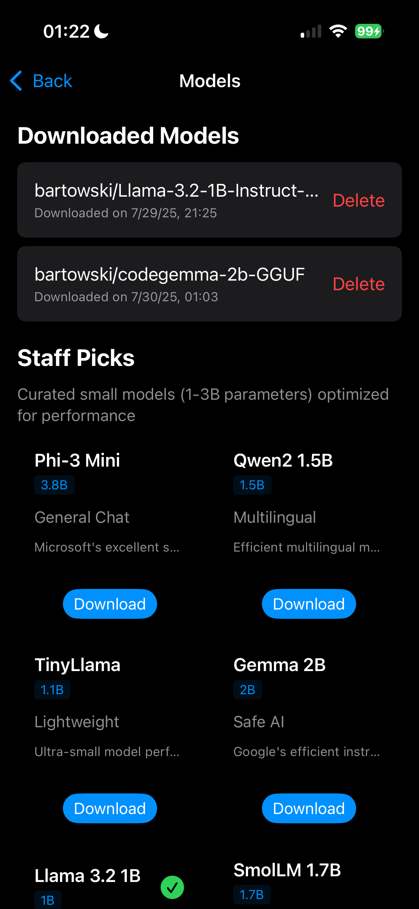

# Q2 Edge Chat
[](https://opensource.org/licenses/Apache-2.0)

A privacy-focused chat application that runs large language models locally on your iPhone; putting the power of generative ai models directly in your hands. Experiment with as many models as you want, ask questions, explore prompts, research different system prompts, and be in full control!

<p align="center">
  
</p>

## Features

### 🔒 Privacy First
- **100% Local Processing** - All conversations stay on your device
- **No Data Collection** - Your chats are never sent to external servers
- **Offline Capable** - Works without internet connection once models are downloaded

### 🧠 Model Management
- **HuggingFace Integration** - Browse and download models from HuggingFace
- **GGUF Support** - Optimized for quantized models (1-3B parameters recommended)
- **Staff Picks** - Curated selection of high-quality small models
- **Smart Search** - Find models by name, author, or description

### 💬 Modern Chat Experience
- **Multiple Conversations** - Manage multiple chat sessions
- **Dynamic Text Input** - Auto-resizing input field with proper cursor positioning
- **Message History** - Persistent chat history across sessions

### 🎨 Beautiful Interface
- **Native SwiftUI** - Smooth, responsive UI following Apple design guidelines
- **Dark/Light Mode** - Automatic theme support
- **Model Picker** - Easy model switching during conversations
- **Sidebar Navigation** - Organized chat management

## Technical Architecture

### Core Components
- **LlamaEngine** - Local inference engine for running GGUF models
- **ModelManager** - Handles model downloading and file management
- **ChatManager** - Manages conversations and model switching
- **ManifestStore** - Persistent storage for downloaded models

### File Structure
```
Q2 Edge Chat/
├── Views/
│   ├── FrontPageView.swift      # Welcome screen
│   ├── ChatView.swift           # Main chat interface
│   ├── ModelBrowserView.swift   # Model discovery and download
│   ├── MessagesView.swift       # Chat message display
│   └── ModelPickerView.swift    # Model selection UI
├── Models/
│   ├── ChatSession.swift        # Chat session data models
│   └── Message.swift           # Message data structures
├── Services/
│   ├── ChatManager.swift        # Chat session management
│   ├── ModelManager.swift       # Model download and storage
│   └── LlamaEngine.swift       # Local inference engine
└── ViewModels/
    ├── ChatViewModel.swift      # Chat UI state management
    └── BrowseModelsViewModel.swift # Model browser logic
```

## Getting Started

### Prerequisites
- iOS 18.0+ or macOS 13.0+
- Xcode 14.0+
- 4GB+ available storage (for models)

### Installation
1. Clone the repository
2. Open `Q2 Edge Chat.xcodeproj` in Xcode
3. Build and run the project
4. Download your first model from the Browse Models screen

### Recommended Models
The app includes curated staff picks of efficient models:
- **Phi-3.5 Mini** (3.8B) - General conversation
- **Qwen2.5-1.5B** (1.5B) - Fast responses
- **SmolLM2-1.7B** (1.7B) - Code assistance
- **TinyLlama-1.1B** (1.1B) - Ultra-lightweight option

## Usage

1. **First Launch** - The welcome screen shows your model count and app status
2. **Download Models** - Tap "Browse Models" to explore and download GGUF models
3. **Start Chatting** - Select a model and begin your conversation
4. **Manage Chats** - Use the sidebar to switch between conversations
5. **Export Data** - Save important conversations using the export feature

## Storage Requirements

- **App Size**: ~50MB
- **Model Storage**: 1-4GB per model (varies by size and quantization)
- **Chat History**: ~1MB per 1000 messages

## Privacy & Security

Q2 Edge Chat is designed with privacy as the core principle:
- No network requests during conversations
- All processing happens on-device
- No analytics or telemetry
- Chat history stored locally only
- Models cached locally after download

## Contributing

We welcome contributions! Please feel free to submit issues and pull requests.

### Development Setup
1. Fork the repository
2. Create a feature branch
3. Make your changes
4. Test thoroughly on device
5. Submit a pull request

## Screenshots

<p align="center">
  
</p>
<p align="center">
  
  
</p>
<p align="center">
  
  
</p>
<p align="center">
  
  
</p>

## License

This project is licensed under the Apache License, Version 2.0. See the [LICENSE](LICENSE) file for details.

## Support

For questions, issues, or feature requests, please open an issue on GitHub.

---

**Note**: This app requires significant device storage and processing power. Performance varies by device capabilities and model size.