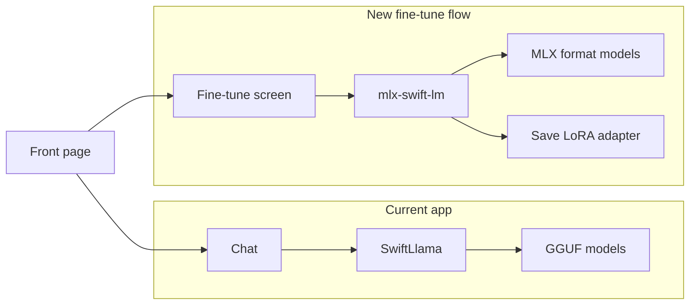

# On-device fine-tuning on iPhone (simplest path)

## Framework choice

- **Use: MLX Swift + mlx-swift-lm.**  
MLX Swift supports iOS 17+ (your app is iOS 18+), provides automatic differentiation, optimizers (e.g. Adam), and NN primitives. The [mlx-swift-lm](https://github.com/ml-explore/mlx-swift-lm) package adds LLM loading (including from Hugging Face), LoRA, and fine-tuning. This is the only practical stack that does **training** on iPhone.
- **Do not use PyTorch/ExecuTorch for training.**  
PyTorch Mobile and ExecuTorch are inference-only on iOS; there is no supported on-device training path.

## Architecture (two paths, no change to existing chat)

Keep the current chat flow as-is (SwiftLlama + GGUF in [LlamaEngine.swift](Q2%20Edge%20Chat/Services/LlamaEngine.swift)). Add a **separate** fine-tuning path that uses MLX only.

- **Chat:** unchanged; continues to use GGUF via SwiftLlama.
- **Fine-tune:** new UI that loads an MLX-format model (e.g. from Hugging Face `mlx-community/`* or local path), runs LoRA fine-tuning, and saves the adapter to app storage. No requirement to use the adapter inside this app for v1; user can export or use in other tools.

## Implementation steps

### 1. Add MLX dependencies (SPM)

In [Q2 Edge Chat.xcodeproj/project.pbxproj](Q2%20Edge%20Chat.xcodeproj/project.pbxproj):

- Add a new **XCRemoteSwiftPackageReference** for `https://github.com/ml-explore/mlx-swift-lm` (branch `main` or a fixed tag; the package pulls in `mlx-swift` and `swift-transformers`).
- Link the **Q2 Edge Chat** app target to the product **MLXLLM** (and **MLXLMCommon** if needed for the high-level load/train API).  
This brings in MLX, MLXNN, MLXOptimizers, and Transformers transitively.

Use the same pattern as the existing QSwiftLlama reference (package reference + product dependency on the app target). No CocoaPods.

### 2. Fine-tuning service (Swift)

Add a new service that wraps the MLX fine-tuning flow so the UI stays thin:

- **File:** e.g. `Q2 Edge Chat/Services/MLXFineTuneService.swift` (or `FineTuneService.swift`).
- **Responsibilities:**
  - Load an MLX model: use mlx-swift-lm’s API (e.g. `loadModel(id:)` for Hugging Face id, or load from a local path if the package supports it). Prefer the **MLXLMCommon** high-level API if it exposes load + LoRA.
  - Accept training data: simplest is a list of prompt/completion or instruction strings (e.g. from a JSON/JSONL file the user picks, or a small in-memory list for MVP).
  - Run a LoRA training loop: use the package’s LoRA fine-tuning APIs (see [mlx-swift-examples LoRATrainingExample](https://github.com/ml-explore/mlx-swift-examples/tree/main/Applications/LoRATrainingExample); that example is macOS-only but the same MLXLM/MLXLLM APIs should work on iOS).
  - Expose progress (e.g. current step, loss) via `@Published` or async callback.
  - Save the LoRA adapter to a user-accessible directory (e.g. Documents or app support); optionally allow share/export.

Implementation detail: follow the **LoRATrainingExample** pattern from [mlx-swift-examples](https://github.com/ml-explore/mlx-swift-examples) (Applications/LoRATrainingExample). That app is macOS-only in the repo; the underlying `mlx-swift-lm` supports iOS, so the same calls can be used from an iOS target. No GaLore in v1 to keep scope minimal; LoRA is enough and is built into mlx-swift-lm.

### 3. Fine-tune UI (minimal)

- **New view:** e.g. `Q2 Edge Chat/Views/FineTuneView.swift`.
- **Fields/actions:**
  - Model source: text field for Hugging Face model id (e.g. `mlx-community/Qwen2-0.5B-Instruct-4bit`) or a “Local path” option if the API supports it. For MVP, HF id is enough.
  - Training data: file picker to select a JSONL (or similar) file, or a simple text area for a few prompt/response pairs.
  - LoRA rank (optional, default e.g. 8), steps/epochs (optional), learning rate (optional).
  - Buttons: **Start**, **Stop**, **Save adapter** (enabled when a run has completed or been stopped).
- **Progress:** show current step and loss (updated from `MLXFineTuneService`).
- **Navigation:** add an entry point from [FrontPageView.swift](Q2%20Edge%20Chat/Views/FrontPageView.swift) (e.g. a “Fine-tune” card or list item) that pushes or presents `FineTuneView`.

### 4. Training data format

Keep the format trivial for v1:

- **Option A:** JSONL with lines like `{"prompt": "...", "completion": "..."}` or `{"instruction": "..."}`.
- **Option B:** A single JSON array of similar objects.

The service parses this and maps it to the format expected by mlx-swift-lm’s fine-tuning API (e.g. list of strings or tokenized pairs). If the package expects a specific format, match it; otherwise use a minimal prompt/completion list.

### 5. Persistence and export

- Save the LoRA adapter (and any config) under the app’s Documents or Application Support directory with a clear name (e.g. `lora_<model_id>_<date>.safetensors` or whatever the package uses).
- Provide a way to **export/share** the adapter file (e.g. share sheet) so the user can use it elsewhere; no need to integrate it into the existing GGUF chat in this phase.

### 6. Error handling and constraints

- **Memory:** Use a small batch size and modest LoRA rank (e.g. 8) by default so that 1B–3B MLX models (or 4-bit quantized 7B) fit on device; document that very large models may OOM.
- **Thermals:** Run the training loop on a background queue; consider pausing or warning if the device gets hot (optional for v1).
- **Errors:** Surface load failures (e.g. invalid HF id or network), training failures, and save/export errors in the UI (e.g. alert or inline message).

## What stays unchanged

- **SwiftLlama and GGUF:** No changes to [LlamaEngine.swift](Q2%20Edge%20Chat/Services/LlamaEngine.swift), [ChatManager.swift](Q2%20Edge%20Chat/Services/ChatManager.swift), or the rest of the chat flow.
- **Model format for chat:** Chat continues to use GGUF only. Fine-tuned outputs are MLX adapters; using them inside this app would require a separate “inference with MLX” path later.

## Optional later steps (out of scope for “simplest”)

- **GaLore:** Could be added on top of MLX (project gradients to low-rank, then optimizer step) for further memory savings; not required for the first version.
- **Use adapter in chat:** Add an MLX-based inference path and allow “load base model + adapter” for chat; would require a second inference engine alongside SwiftLlama.
- **Convert GGUF → MLX:** Out of scope; user uses MLX-format models for fine-tuning (e.g. from Hugging Face mlx-community).

## Summary

| Item                       | Choice                                                                        |
| -------------------------- | ----------------------------------------------------------------------------- |
| Framework                  | MLX Swift + mlx-swift-lm (SPM)                                                |
| Training method            | LoRA (built into mlx-swift-lm)                                                |
| Model format for fine-tune | MLX (e.g. Hugging Face mlx-community)                                         |
| Chat                       | Unchanged; still SwiftLlama + GGUF                                            |
| New code                   | 1 service (MLX fine-tune), 1 view (Fine-tune UI), 1 nav entry from front page |
| Adapter usage              | Save + export; no in-app chat integration in v1                               |

---

## Appendix: Evidence that mlx-swift-lm provides LoRA fine-tuning

This appendix documents that mlx-swift-lm actually implements the capabilities the plan relies on (load model, LoRA adapters, train, save adapter). All references are to the official [ml-explore/mlx-swift-lm](https://github.com/ml-explore/mlx-swift-lm) and [ml-explore/mlx-swift-examples](https://github.com/ml-explore/mlx-swift-examples) repositories.

### 1. Official README

From [mlx-swift-lm README](https://github.com/ml-explore/mlx-swift-lm/blob/main/README.md):

> **Some key features include:**
>
> - Integration with the Hugging Face Hub to easily use thousands of LLMs with a single command.
> - **Low-rank (LoRA) and full model fine-tuning with support for quantized models.**
> - Many model architectures for both LLMs and VLMs.

So the package explicitly advertises LoRA and full fine-tuning, including quantized models.

### 2. LoRA training API in the package

The training implementation lives in **mlx-swift-lm**, not in the examples repo.

**File: `Libraries/MLXLLM/LoraTrain.swift`** (in ml-explore/mlx-swift-lm):

- `**LoRATrain.train(...)**` – full training loop: forward/backward, optimizer update, progress callback, validation, optional saving.
- `**LoRATrain.evaluate(...)**` – evaluation loss over a dataset.
- `**LoRATrain.saveLoRAWeights(model:url:)**` – writes adapter weights to `.safetensors`.
- `**LoRATrain.Parameters**` – `batchSize`, `iterations`, `stepsPerReport`, `stepsPerEval`, `validationBatches`, `saveEvery`, `adapterURL`.
- `**LoRATrain.Progress**` – train/validation/save progress; `**ProgressDisposition**` – `.stop` / `.more` for the callback.

The in-file doc comment describes the intended flow: load model → add LoRA layers (e.g. `LoRATrain.convert`) → load train/valid data (e.g. `loadLoRAData`) → call `LoRATrain.train` with an optimizer → then save via `saveLoRAWeights` or fuse. So the package exposes a complete “load and fine-tune with LoRA” API.

### 3. LoRA adapter container and config (MLXLMCommon)

**File: `Libraries/MLXLMCommon/Adapters/LoRA/LoRAContainer.swift`** (same repo):

- `**LoRAConfiguration**` – `numLayers`, `fineTuneType` (`.lora` / `.dora`), `LoRAParameters` (rank, scale, keys).
- `**LoRAContainer.from(model:configuration:)**` – creates LoRA adapters from a `LanguageModel`, freezes base weights, returns a container.
- `**LoRAContainer.from(directory:)**` – loads adapter from `adapter_config.json` + `adapters.safetensors`.
- `**load(into:)**` / `**fuse(with:)**` / `**unload(from:)**` – apply, fuse, or remove adapters.

So the package provides the full LoRA lifecycle: create, train (via `LoRATrain`), save/load, apply/fuse.

### 4. Working app that uses it (mlx-swift-examples)

**LoRATrainingExample** in [ml-explore/mlx-swift-examples](https://github.com/ml-explore/mlx-swift-examples) uses **MLXLLM** and **MLXLMCommon** (i.e. mlx-swift-lm) and no other training stack:

- Imports: `MLXLLM`, `MLXLMCommon`, `MLXNN`, `MLXOptimizers`.
- Loads model: `LLMModelFactory.shared.loadContainer(configuration: modelConfiguration)` (e.g. Mistral 7B 4-bit).
- Adds LoRA: `LoRAContainer.from(model:context.model, configuration: LoRAConfiguration(numLayers: loraLayers))`.
- Loads data: `MLXLLM.loadLoRAData(url: url)` for JSONL.
- Trains: `LoRATrain.train(model:context.model, train: train, validate: valid, optimizer: optimizer, tokenizer: context.tokenizer, parameters: parameters) { progress in ... }`.
- Evaluates: `LoRATrain.evaluate(model:context.model, dataset: test, tokenizer: context.tokenizer, ...)`.
- Generates: `MLXLMCommon.generate(...)` with the adapted model.

So the same APIs the plan relies on are already used in a real app (that app is macOS-only in the example; the packages themselves support iOS 17+).

### 5. Repo layout (mlx-swift-lm)

From the repository tree:

- **MLXLLM:** `LoraTrain.swift`, `Lora+Data.swift`, plus many model implementations (Llama, Mistral, Qwen, etc.).
- **MLXLMCommon:** `Adapters/LoRA/LoRAContainer.swift`, `LoRA+Layers.swift`, `LoRAModel.swift`, etc.

So LoRA and training are first-class parts of the library, not a side experiment.

### Summary table (evidence vs plan claims)

| Claim                                   | Evidence                                                                              |
| --------------------------------------- | ------------------------------------------------------------------------------------- |
| “LoRA and full fine-tuning”             | README; `LoRATrain` + `LoRAContainer` in mlx-swift-lm.                                |
| “Load model from Hugging Face”          | README; `LLMModelFactory.loadContainer` in LoRATrainingExample.                       |
| “Train with LoRA (optimizer, progress)” | `LoRATrain.train(...)` in `LoraTrain.swift` with Adam, progress callback, validation. |
| “Save adapter”                          | `LoRATrain.saveLoRAWeights(model:url:)`; `LoRAContainer.from(directory:)`.            |
| “Quantized models”                      | README; example uses Mistral 7B 4-bit.                                                |

